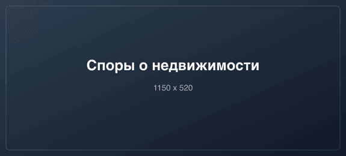

# ⚖️ Адвокатский кабинет — Сайт адвоката Ежова А.В.

Проект сайта адвоката с автоматизированным процессом компиляции стилей (SCSS), **масштабируемой версткой (Auto Scale)** и оптимизацией/конвертацией изображений в современные форматы (AVIF, WebP, Retina 2x, адаптивные размеры).

---

## 📋 Содержание

- [Требования и установка](#-требования-и-установка)
- [Структура проекта](#-структура-проекта)
- [Масштабируемая верстка (Auto Scale)](#-масштабируемая-верстка-auto-scale)
- [Работа с SCSS стилями](#-работа-с-scss-стилями)
- [Оптимизация и конвертация изображений](#-оптимизация-и-конвертация-изображений)
- [Как настраивать качество и параметры сжатия](#-как-настраивать-качество-и-параметры-сжатия)
- [Пример вставки картинок в HTML](#-пример-вставки-картинок-в-html)
- [Сводная таблица NPM команд](#-сводная-таблица-npm-команд)

---

## 🚀 Требования и установка

1. Убедитесь, что на компьютере установлен **Node.js** (версии 18+). Проверить можно командой:
   ```bash
   node -v
   npm -v
   ```

2. Установите зависимости проекта (выполняется один раз в папке проекта):
   ```bash
   npm install
   ```

---

## 📐 Масштабируемая верстка (Auto Scale)

Весь проект переведен в **Auto Scale (масштабируемую верстку)**:

### Как это работает:
- **Базовые разрешения макетов:**
  - Десктоп: **1440px** (`$design-width-desktop: 1440;`)
  - Мобильные: **375px** (`$design-width-mobile: 375;`)
- В теге `html` рассчитывается динамический `font-size` через `calc(100vw / [design_width] * 16)` с защитными границами `clamp()`.
- Все размеры, отступы (`padding`, `margin`, `gap`), шрифты (`font-size`), скругления (`border-radius`) и элементы интерфейса задаются через функцию **`rem(px)`**.
- При изменении ширины окна браузера на любых мониторах и смартфонах **все элементы масштабируются плавно и пропорционально (Auto Scale)**, сохраняя пиксель-в-пиксель вид из Figma без скачков и ломающейся верстки.

### SCSS функции и хелперы в `abstracts/_mixins.scss`:

1. **`rem($px)`** — основная функция. Конвертирует пиксели из макета в масштабируемые `rem`:
   ```scss
   .hero__title {
     font-size: rem(48); // на 1440px будет ровно 48px, на других экранах масштабируется плавно
     margin-bottom: rem(24);
     padding: rem(16) rem(32);
   }
   ```

2. **`vw-d($px)`** и **`vw-m($px)`** — конвертирует пиксели напрямую в `vw` относительно десктопа или мобильного:
   ```scss
   .custom-banner {
     width: vw-d(600); // % от экрана десктопа
   }
   ```

3. **`fluid($min-px, $max-px, $min-vw, $max-vw)`** — плавная интерполяция значения от минимального экрана до максимального через `clamp()`.

---

## 📁 Структура проекта

```text
advokat-site/
├── assets/
│   ├── css/                 # Скомпилированные стили (style.css, style.min.css)
│   ├── fonts/               # Шрифты сайта
│   ├── img/                 # Оптимизированные готовые изображения (.avif, .webp, .jpg, .png)
│   ├── js/                  # JavaScript файлы (main.js)
│   └── scss/                # Исходный код стилей SCSS
│       ├── abstracts/       # Переменные (_variables.scss), миксины и auto scale (_mixins.scss)
│       ├── base/            # Сброс (_reset.scss), типографика, базовые классы и root html font-size
│       ├── components/      # Кнопки, карточки, слайдеры, формы
│       ├── sections/        # Стили отдельных секций (header, hero, about, cta и др.)
│       └── style.scss       # Главный файл (точка входа)
├── src/
│   └── images/              # 📥 ИСХОДНИКИ оригинальных картинок (сюда класть новые фото)
├── scripts/
│   └── optimize-images.js   # Скрипт оптимизации, ресайза и конвертации изображений
├── index.html               # Главная страница
├── package.json             # Конфигурация NPM и скрипты
└── README.md                # Эта инструкция
```

---

## 🎨 Работа с SCSS стилями

Стили разделены по модульной структуре **7-1 pattern**:

- Все настройки цветов, градиентов, шрифтов и брейкпоинтов находятся в `assets/scss/abstracts/_variables.scss`.
- Для каждой секции сайта создан отдельный файл в `assets/scss/sections/` (например, `_header.scss`, `_hero.scss`, `_cta.scss`).
- Все модули подключаются в главный файл `assets/scss/style.scss`.

### Команды для работы со стилями:

- **Автоматическая компиляция при сохранении (Watch)**:
  ```bash
  npm run watch:css
  ```
  *(Следит за изменениями любых `.scss` файлов и мгновенно компилирует в `assets/css/style.css` и `assets/css/style.min.css`)*

- **Разовая сборка стилей**:
  ```bash
  npm run build:css   # Сборка развернутого читаемого style.css
  npm run build:min   # Сборка сжатого style.min.css
  ```

---

## 🖼️ Оптимизация и конвертация изображений

В проекте настроен автоматический пайплайн на базе библиотеки `sharp`:

1. **Как добавлять новые изображения**:
   - Поместите исходное качественное изображение (PNG, JPG, JPEG) в папку **`src/images/`**.
2. **Что происходит автоматически**:
   - Исходник сжимается без потери визуального качества и очищается от лишних метаданных.
   - Создаются современные форматы **`.avif`** (лучшее сжатие) и **`.webp`** (универсальный современный формат).
   - Создаются **адаптивные размеры** под разные экраны:
     - `1x` — базовый размер для десктопа;
     - `2x` (`-2x`) — двойное разрешение для Retina-дисплеев (четкие фото на экранах высокого разрешения);
     - `sm` (`-sm` / `-mobile` / `-tablet`) — оптимизированные уменьшенные размеры для смартфонов и планшетов.
   - Готовые файлы сохраняются в папку **`assets/img/`**.

### Команды для изображений:

- **Запуск автослежения за папкой картинок**:
  ```bash
  npm run images:watch
  ```
  *(При добавлении нового файла в `src/images/` он мгновенно оптимизируется, а при удалении исходника сгенерированные файлы автоматически удаляются)*

- **Разовая оптимизация всех картинок**:
  ```bash
  npm run images
  ```

- **Принудительная перегенерация всех картинок заново**:
  ```bash
  npm run images:force
  ```

---

## ⚙️ Как настраивать качество и параметры сжатия

Все настройки сжатия и размеров находятся в файле **`scripts/optimize-images.js`**.

### 1. Настройка качества форматов

Откройте `scripts/optimize-images.js` и отредактируйте объект `CONFIG` (в начале файла):

```javascript
const CONFIG = {
  // Настройки JPEG (от 1 до 100, рекомендуемое 80-85)
  jpeg: {
    quality: 82,            // Уровень качества
    mozjpeg: true,          // Использовать улучшенный алгоритм MozJPEG
    progressive: true       // Прогрессивная загрузка
  },

  // Настройки PNG
  png: {
    compressionLevel: 9,    // Степень сжатия (0-9)
    palette: true,          // Квантование палитры для сильного снижения веса
    quality: 85             // Качество палитры (от 1 до 100)
  },

  // Настройки WebP (от 1 до 100, рекомендуемое 80-85)
  webp: {
    quality: 82,            // Качество WebP
    effort: 6               // Усилие сжатия процессором от 0 (быстро) до 6 (максимально сжато)
  },

  // Настройки AVIF (от 1 до 100, рекомендуемое 70-80)
  avif: {
    quality: 78,            // Качество AVIF (при 75-80 дает качество сравнимое с JPEG 90)
    effort: 6               // Усилие сжатия процессором (0-9)
  },
};
```

---

## 💻 Пример вставки картинок в HTML

Для максимальной скорости загрузки и поддержки всех экранов используйте конструкцию с `<picture>`:

```html
<picture>
    <!-- 1. Самый современный формат AVIF (разные размеры под устройства) -->
    <source type="image/avif" 
            srcset="assets/img/expertise-1-sm.avif 360w, 
                    assets/img/expertise-1.avif 575w, 
                    assets/img/expertise-1-2x.avif 1150w" 
            sizes="(max-width: 768px) 100vw, 575px">

    <!-- 2. Формат WebP для браузеров без поддержки AVIF -->
    <source type="image/webp" 
            srcset="assets/img/expertise-1-sm.webp 360w, 
                    assets/img/expertise-1.webp 575w, 
                    assets/img/expertise-1-2x.webp 1150w" 
            sizes="(max-width: 768px) 100vw, 575px">

    <!-- 3. Стандартный fallback (PNG/JPG) с ленивой загрузкой -->
    
</picture>
```

---

## 📊 Сводная таблица NPM команд

| Команда | Что делает |
|---|---|
| `npm start` *(или `npm run watch`, `npm run dev`)* | **Основная команда разработчика**: параллельно следит за SCSS и изображениями в реальном времени |
| `npm run build` | Полная продакшн-сборка: компиляция `.css`, `.min.css` и оптимизация картинок |
| `npm run build:css` | Сборка несжатого `assets/css/style.css` |
| `npm run build:min` | Сборка минифицированного `assets/css/style.min.css` |
| `npm run watch:css` | Слежение только за SCSS файлами |
| `npm run images` | Разовая оптимизация всех картинок из `src/images/` |
| `npm run images:watch` | Слежение только за добавлением/изменением картинок в `src/images/` |
| `npm run images:force` | Принудительное повторное сжатие всех картинок |
